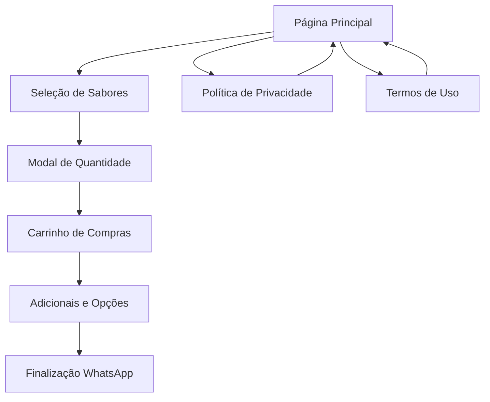

# Documento de Requisitos do Produto - Crepe da Mara

## 1. Visão Geral do Produto

O Crepe da Mara é um cardápio digital interativo desenvolvido para uma lanchonete especializada em crepes. O sistema permite que clientes naveguem pelo menu, personalizem pedidos e finalizem compras através de integração direta com WhatsApp, proporcionando uma experiência moderna e eficiente para pedidos de comida.

O produto resolve o problema de pedidos manuais e comunicação ineficiente, oferecendo uma interface digital intuitiva que facilita tanto para clientes quanto para o estabelecimento. O valor de mercado está na digitalização de pequenos negócios alimentícios e na melhoria da experiência do cliente.

## 2. Funcionalidades Principais

### 2.1 Papéis de Usuário

| Papel | Método de Registro | Permissões Principais |
|-------|-------------------|----------------------|
| Cliente | Acesso direto (sem registro) | Navegar cardápio, fazer pedidos, personalizar itens |
| Proprietário | Acesso administrativo | Gerenciar cardápio, receber pedidos via WhatsApp |

### 2.2 Módulo de Funcionalidades

Nossos requisitos do cardápio digital consistem nas seguintes páginas principais:

1. **Página Principal (Cardápio)**: seção de cabeçalho, menu de sabores, carrinho de compras, sistema de adicionais, finalização de pedido
2. **Política de Privacidade**: informações sobre coleta de dados, direitos LGPD, cookies e rastreamento
3. **Termos de Uso**: responsabilidades do usuário, limitações de uso, política de pedidos

### 2.3 Detalhes das Páginas

| Nome da Página | Nome do Módulo | Descrição da Funcionalidade |
|----------------|----------------|----------------------------|
| Página Principal | Cabeçalho | Exibir marca "Crepe da Mara" com fonte decorativa, subtítulo explicativo |
| Página Principal | Menu de Sabores | Mostrar 6 sabores em cards responsivos com preços (R$ 13,00 e R$ 15,00), botões de adicionar |
| Página Principal | Modal de Quantidade | Permitir seleção de quantidade específica para cada item antes de adicionar ao carrinho |
| Página Principal | Carrinho de Compras | Gerenciar itens selecionados, ajustar quantidades (+/-), calcular total automaticamente |
| Página Principal | Sistema de Adicionais | Oferecer opções de milho, tomate ou nenhum adicional com lógica exclusiva |
| Página Principal | Opções de Entrega | Checkbox para definir se pedido é para viagem ou consumo local |
| Página Principal | Finalização | Botão integrado ao WhatsApp para enviar pedido formatado, validação de carrinho não vazio |
| Política de Privacidade | Conteúdo Legal | Explicar coleta de dados, uso de cookies do Google AdSense, direitos LGPD |
| Termos de Uso | Conteúdo Legal | Definir responsabilidades do usuário, limitações de uso, política de cancelamentos |

## 3. Processo Principal

### Fluxo do Cliente:
O cliente acessa o cardápio digital, navega pelos sabores disponíveis, seleciona itens desejados através de modal de quantidade, personaliza com adicionais, revisa o carrinho com total calculado automaticamente, configura opções de entrega e finaliza enviando o pedido via WhatsApp.

### Fluxo do Proprietário:
O proprietário recebe pedidos formatados via WhatsApp contendo todos os detalhes (itens, quantidades, adicionais, observações), confirma disponibilidade, informa tempo de preparo e processa o pedido.

## 4. Design da Interface do Usuário

### 4.1 Estilo de Design

- **Cores Primárias**: Âmbar (#f59e0b) e tons de laranja para identidade acolhedora
- **Cores Secundárias**: Cinza para textos, branco para fundos de cards
- **Estilo de Botões**: Arredondados com efeitos hover e transformação de escala
- **Fontes**: Inter (400, 600, 700) para textos gerais, Pacifico para título decorativo
- **Layout**: Design baseado em cards, navegação superior, layout responsivo mobile-first
- **Ícones e Emojis**: Uso de emojis no rodapé (❤️), ícones de + e - para quantidades

### 4.2 Visão Geral do Design das Páginas

| Nome da Página | Nome do Módulo | Elementos da UI |
|----------------|----------------|-----------------|
| Página Principal | Cabeçalho | Título com fonte Pacifico em âmbar, subtítulo em cinza, fundo âmbar claro |
| Página Principal | Cards de Sabores | Grid responsivo 1-2 colunas, cards brancos com sombra, preços em âmbar, botões laranja |
| Página Principal | Carrinho | Seção com borda tracejada, itens em fundo cinza claro, botões circulares para quantidade |
| Página Principal | Modal | Overlay escuro, card branco centralizado, input numérico, botões de ação |
| Página Principal | Adicionais | Checkboxes personalizados em âmbar, labels em cinza escuro |
| Página Principal | Finalização | Fundo âmbar claro, total em destaque, botão verde para WhatsApp |
| Política/Termos | Layout Geral | Mesmo padrão visual, conteúdo em seções organizadas, navegação de volta |

### 4.3 Responsividade

O produto é mobile-first e totalmente adaptativo, com grid que se ajusta de 1 coluna (mobile) para 2 colunas (desktop), botões e textos que escalam adequadamente, e otimização para interação touch em dispositivos móveis.