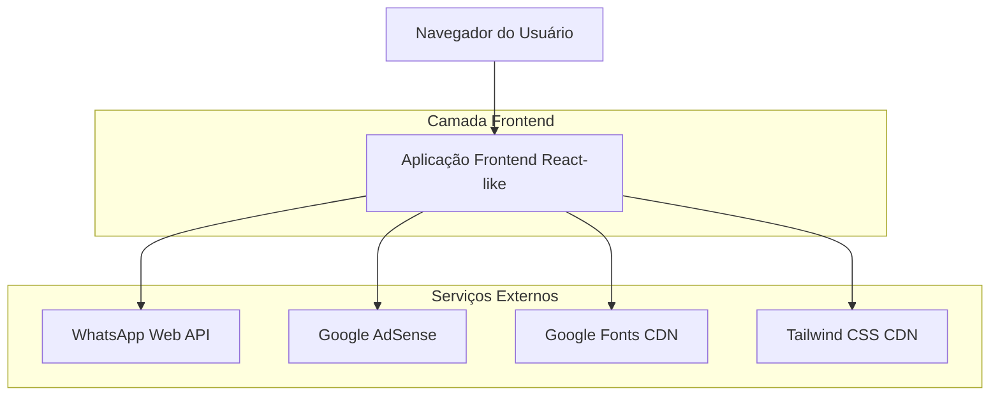
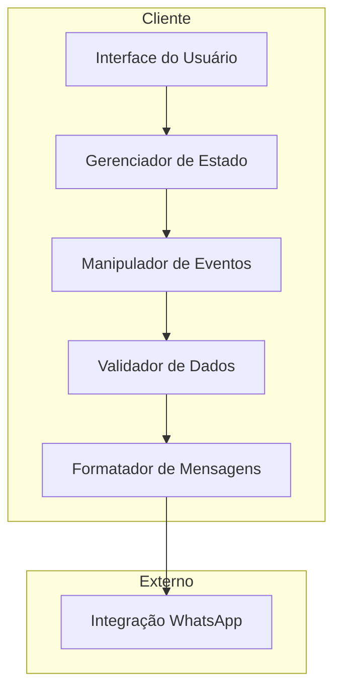
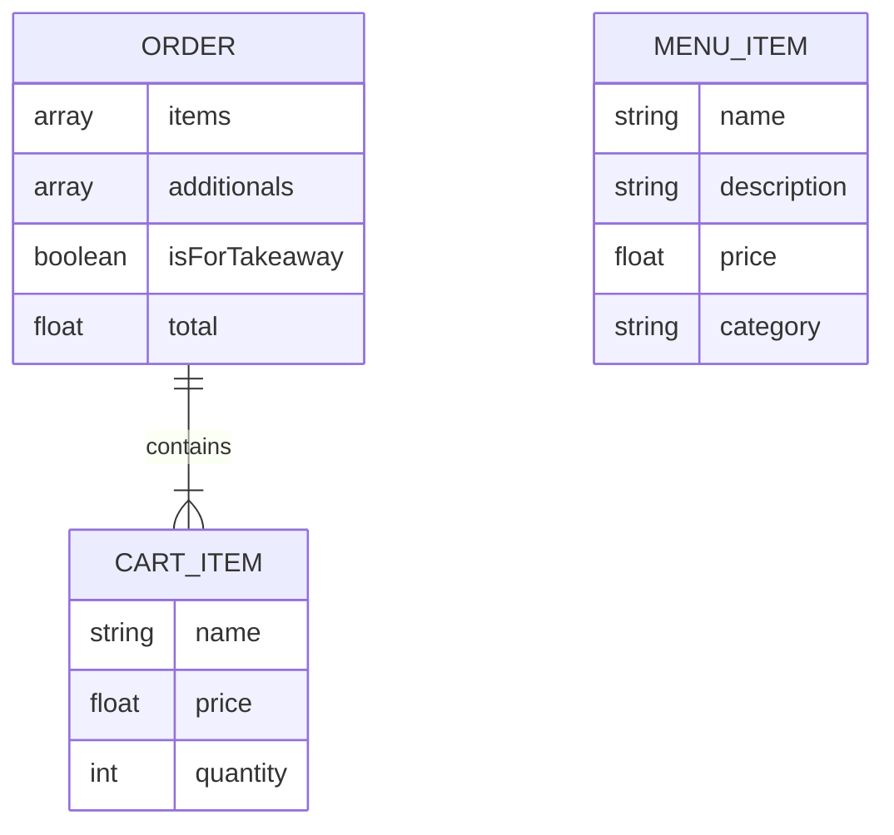

# Documento de Arquitetura Técnica - Crepe da Mara

## 1. Design da Arquitetura



## 2. Descrição das Tecnologias

- **Frontend**: HTML5 + JavaScript ES6+ + Tailwind CSS via CDN
- **Backend**: Nenhum (aplicação client-side)
- **Integração**: WhatsApp Web API para pedidos
- **Monetização**: Google AdSense
- **Fontes**: Google Fonts (Inter + Pacifico)

## 3. Definições de Rotas

| Rota | Propósito |
|------|-----------|
| /index.html | Página principal do cardápio, exibe menu interativo e carrinho |
| /privacy-policy.html | Política de privacidade, informações sobre LGPD e cookies |
| /terms-of-use.html | Termos de uso, responsabilidades e limitações do serviço |

## 4. Definições de API

### 4.1 API Principal

Integração com WhatsApp Web
```
GET https://wa.me/{whatsappNumber}?text={encodedMessage}
```

Parâmetros:
| Nome do Parâmetro | Tipo | Obrigatório | Descrição |
|-------------------|------|-------------|-----------|
| whatsappNumber | string | true | Número do WhatsApp no formato internacional |
| text | string | true | Mensagem do pedido codificada em URL |

Resposta:
| Nome do Parâmetro | Tipo | Descrição |
|-------------------|------|-----------|
| redirect | boolean | Redirecionamento para aplicativo WhatsApp |

Exemplo de mensagem formatada:
```json
{
  "message": "Olá, *Crepe da Mara*! Gostaria de fazer um pedido:\n\n*ITENS DO PEDIDO:*\n- 2x Queijo e Presunto\n- 1x Queijo e Chocolate\n\n*ADICIONAIS:*\n- Milho\n\n*OBSERVAÇÃO:*\n- Para Viagem\n\n*TOTAL:* R$ 39,00"
}
```

### 4.2 APIs de Terceiros

Google AdSense
```
GET https://pagead2.googlesyndication.com/pagead/js/adsbygoogle.js
```

Google Fonts
```
GET https://fonts.googleapis.com/css2?family=Inter:wght@400;600;700&family=Pacifico
```

Tailwind CSS
```
GET https://cdn.tailwindcss.com
```

## 5. Arquitetura do Cliente



## 6. Modelo de Dados

### 6.1 Definição do Modelo de Dados



### 6.2 Estruturas de Dados JavaScript

Estrutura do Item do Carrinho
```javascript
// Estrutura do item no carrinho
const cartItem = {
    name: "Queijo e Presunto",     // Nome do sabor
    price: 13.00,                  // Preço unitário
    quantity: 2                    // Quantidade selecionada
};

// Array do carrinho
let cart = [
    {
        name: "Queijo e Presunto",
        price: 13.00,
        quantity: 2
    },
    {
        name: "Queijo e Chocolate", 
        price: 13.00,
        quantity: 1
    }
];

// Configuração de adicionais
const additionals = {
    milho: false,
    tomate: true,
    nenhum: false
};

// Configuração do pedido
const orderConfig = {
    isForTakeaway: true,
    whatsappNumber: "5568992481275"
};
```

Estrutura do Item do Menu
```javascript
// Definição dos itens do menu
const menuItems = [
    {
        name: "Queijo e Presunto",
        description: "O clássico que todo mundo ama.",
        price: 13.00,
        category: "classico"
    },
    {
        name: "Queijo e Calabresa",
        description: "Sabor marcante e irresistível.",
        price: 15.00,
        category: "premium"
    }
];
```

Funções Principais
```javascript
// Função para adicionar item ao carrinho
function addToCart(name, price, quantity) {
    const existingItem = cart.find(item => item.name === name);
    if (existingItem) {
        existingItem.quantity += quantity;
    } else {
        cart.push({ name, price, quantity });
    }
}

// Função para calcular total
function calculateTotal() {
    return cart.reduce((sum, item) => sum + (item.price * item.quantity), 0);
}

// Função para formatar mensagem do WhatsApp
function formatWhatsAppMessage() {
    const itemsMessage = cart.map(item => 
        `- ${item.quantity}x ${item.name}`
    ).join('\n');
    
    const total = calculateTotal();
    
    return `Olá, *Crepe da Mara*! Gostaria de fazer um pedido:\n\n*ITENS DO PEDIDO:*\n${itemsMessage}\n\n*TOTAL:* R$ ${total.toFixed(2).replace('.', ',')}`;
}
```